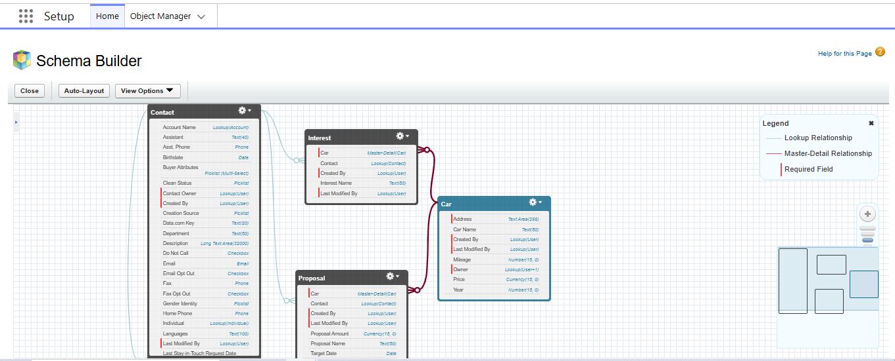
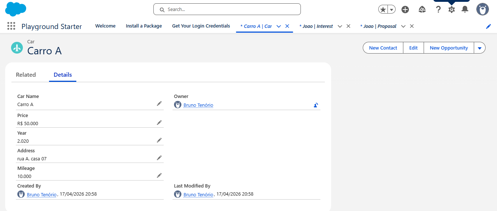
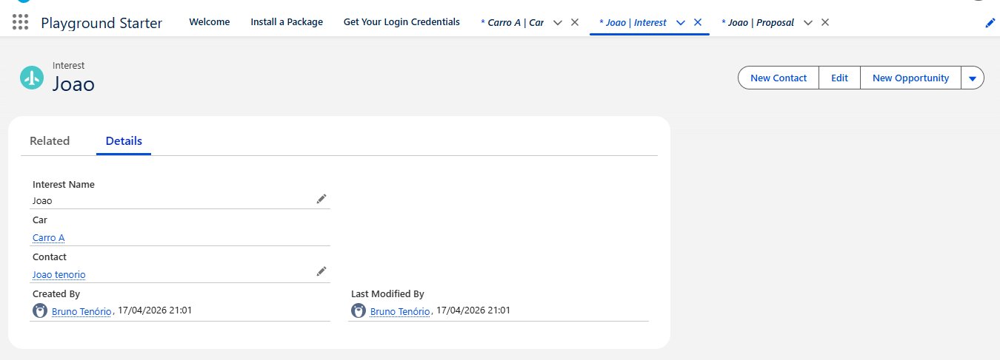
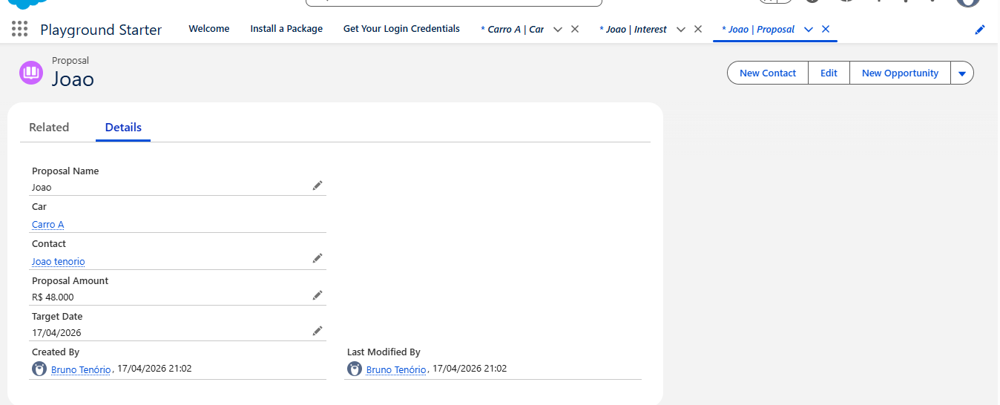

# Sistema-de-Gest-o-de-Venda-de-Carros---Salesforcestatus-

## 📌 Descrição

Este projeto simula um processo de venda de carros utilizando a plataforma Salesforce.
A solução permite cadastrar veículos, registrar o interesse de clientes e gerenciar propostas de compra.

O sistema foi desenvolvido com foco em entender a modelagem de dados e o relacionamento entre objetos dentro do Salesforce.

---

## 🎯 Objetivo

Organizar o processo de vendas de veículos, desde o cadastro do carro até a interação com clientes interessados e o envio de propostas.

---

## 🧱 Estrutura do Projeto

### 🔹 Objetos Utilizados

* **Car__c**
  Armazena as informações dos veículos disponíveis para venda.
  Exemplo de dados: modelo, marca, ano, preço.

* **Interest__c**
  Representa o interesse de um cliente em um carro específico.

* **Proposal__c**
  Registra as propostas feitas pelos clientes para compra de um veículo.

* **Contact (padrão do Salesforce)**
  Armazena os dados dos clientes.

---

## 🔗 Relacionamentos

* Um **Car__c** pode ter vários **Interest__c**
* Um **Car__c** pode ter várias **Proposal__c**
* Um **Contact** pode estar relacionado a vários interesses e propostas

---

## ⚙️ Funcionalidades

* Cadastro de veículos
* Registro de clientes (Contact)
* Criação de interesses em veículos
* Envio de propostas de compra
* Organização do processo de negociação

---

## 🧠 Aprendizados

Durante o desenvolvimento deste projeto, foram aplicados os seguintes conceitos:

* Criação de objetos personalizados (Custom Objects)
* Criação de campos personalizados (Custom Fields)
* Relacionamento entre objetos (Lookup / Master-Detail)
* Estruturação de um processo de negócio no Salesforce
* Uso do Trailhead Playground para simulação de ambiente real

---

## 🚀 Possíveis Melhorias

* Implementar automações com **Flow**

  * Ex: notificar quando uma proposta for criada
* Criar processo de aprovação de propostas
* Desenvolver relatórios e dashboards
* Adicionar validações nos dados
* Implementar status para propostas (Aprovada, Rejeitada, Pendente)

---

## 📸 Demonstração

## 🔗 Diagrama de Relacionamento

---

## 📸 Exemplos do Sistema

### 🚗 Carro cadastrado

### ❤️ Interesse do cliente

### 💰 Proposta de compra

---

## 📂 Tecnologias Utilizadas

* Salesforce Platform
* Trailhead Playground

---

## 👤 Autor

Projeto desenvolvido para fins de aprendizado em Salesforce.

---

## 📎 Observação

Este projeto não utiliza código Apex, sendo focado na modelagem de dados e processos declarativos dentro do Salesforce.
